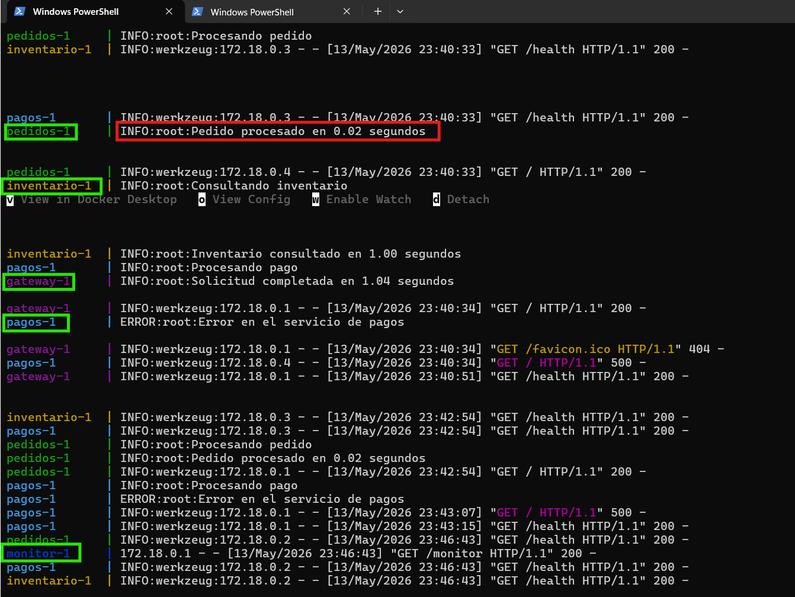
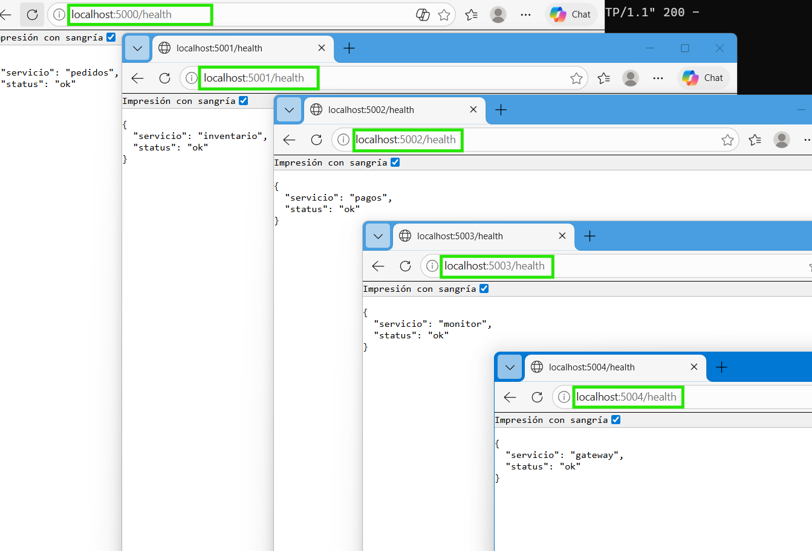
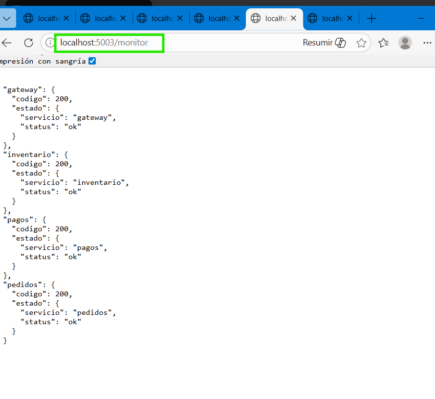
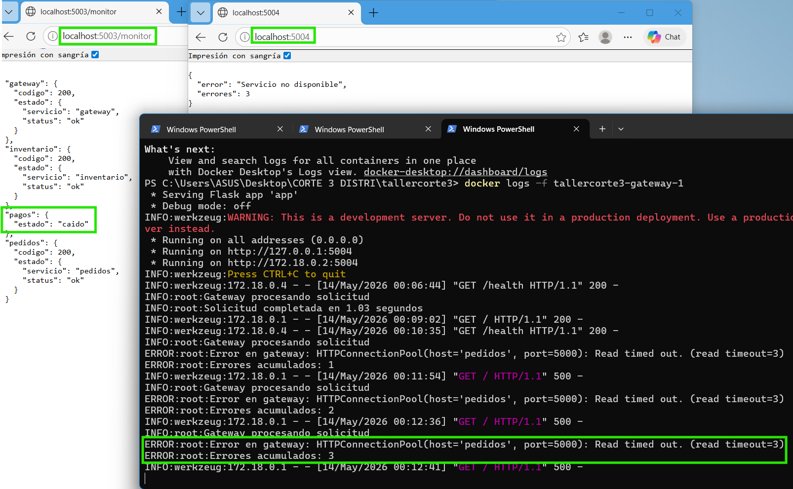
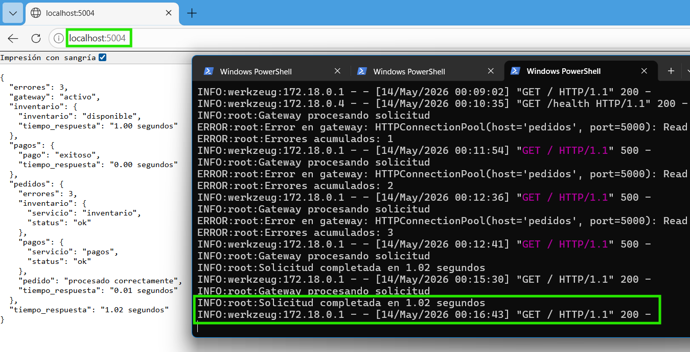

# Sistema de Pedidos Distribuido — Monitoreo y Observabilidad

# Introducción

Este laboratorio tiene como objetivo implementar monitoreo básico en un sistema distribuido compuesto por múltiples microservicios.  

Se desarrolló un sistema de pedidos utilizando Flask y Docker Compose, implementando logs, health checks, monitoreo centralizado, simulación de fallos y métricas básicas para analizar el comportamiento del sistema ante errores.

# Arquitectura del Sistema

El sistema está compuesto por 5 microservicios:

Gateway - Punto central de acceso - 5004 

Pedidos - Procesamiento de pedidos - 5000 

Inventario - Consulta de inventario - 5001 

Pagos - Procesamiento de pagos - 5002 

Monitor - Monitoreo de servicios - 5003 

La arquitectura funciona de la siguiente manera:

Cliente → Gateway → Microservicios

# Tecnologías Utilizadas

- Python
- Flask
- Docker
- Docker Compose

# Estructura del Proyecto

─ pedidos ─ inventario ─ pagos ─ monitor ─ gateway ─ docker-compose.yml

# FASE 1 — Logs

## Objetivo

Implementar logs descriptivos para analizar el comportamiento de los servicios distribuidos.

## Implementación

Se utilizaron logs mediante la librería logging de Python para registrar:

- solicitudes realizadas
- tiempos de respuesta
- errores
- estado de los servicios

## Evidencia

## Resultados Observados

- Cada microservicio genera logs independientes.
- Los logs permiten identificar errores y analizar el flujo del sistema.
- Docker Compose levantó correctamente todos los contenedores.

# FASE 2 — Health Checks

## Objetivo

Verificar la disponibilidad de cada microservicio mediante endpoints /health

## Implementación

Cada servicio implementó un endpoint:

/health

que responde el estado del servicio.

## Endpoints utilizados

- http://localhost:5000/health
- http://localhost:5001/health
- http://localhost:5002/health
- http://localhost:5003/health
- http://localhost:5004/health

## Evidencia

## Resultados Observados

- Todos los microservicios respondieron correctamente.
- Se validó la disponibilidad del sistema distribuido.
- Los health checks permitieron detectar servicios activos.

# FASE 3 — Monitoreo

## Objetivo

Centralizar el monitoreo de todos los servicios distribuidos.

## Implementación

Se creó un servicio monitor encargado de consultar los endpoints /health de cada microservicio.

Endpoint principal:

http://localhost:5003/monitor

## Evidencia

## Resultados Observados

- El monitor centralizó el estado de todos los servicios.
- Se validó la disponibilidad general del sistema.
- El monitoreo permitió identificar servicios activos y caídos.

# FASE 4 — Simulación de Fallos

## Objetivo

Analizar el comportamiento del sistema cuando el servicio de pagos falla.

## Implementación

Se detuvo el servicio de pagos utilizando:

docker compose stop pagos

Posteriormente se analizaron:

- logs
- errores
- disponibilidad
- respuesta del monitor

## Evidencia — Servicio Caído

## Resultados Observados

- El monitor detectó correctamente el servicio caído.
- El gateway registró errores al intentar comunicarse con pagos.
- Los logs permitieron identificar fallos de conexión.
- El sistema continuó funcionando parcialmente.

# FASE 5 — Métricas

## Objetivo

Medir métricas básicas del sistema distribuido.

## Métricas Implementadas

- tiempo de respuesta
- cantidad de errores
- disponibilidad

## Implementación

Se midieron tiempos de respuesta utilizando:

time.time()

y se implementó un contador de errores acumulados.

## Evidencia — Tiempo de Respuesta

## Resultados Observados

- El sistema registró tiempos de respuesta correctamente.
- Se contabilizaron errores generados durante los fallos.
- Las métricas permitieron analizar el comportamiento del sistema distribuido.

# Resultados Generales

Durante el desarrollo del laboratorio se logró:

- implementar monitoreo básico
- detectar fallos en microservicios
- analizar logs distribuidos
- medir tiempos de respuesta
- validar disponibilidad de servicios
- centralizar monitoreo mediante un servicio monitor

# Conclusiones

- El monitoreo es fundamental en sistemas distribuidos.
- Los logs permiten identificar errores rápidamente.
- Los health checks ayudan a validar disponibilidad.
- El monitoreo centralizado facilita la detección de fallos.
- Las métricas básicas permiten analizar el rendimiento del sistema.

# Repositorio

https://github.com/valen-samboni/Distribuidos-corte3.git 
